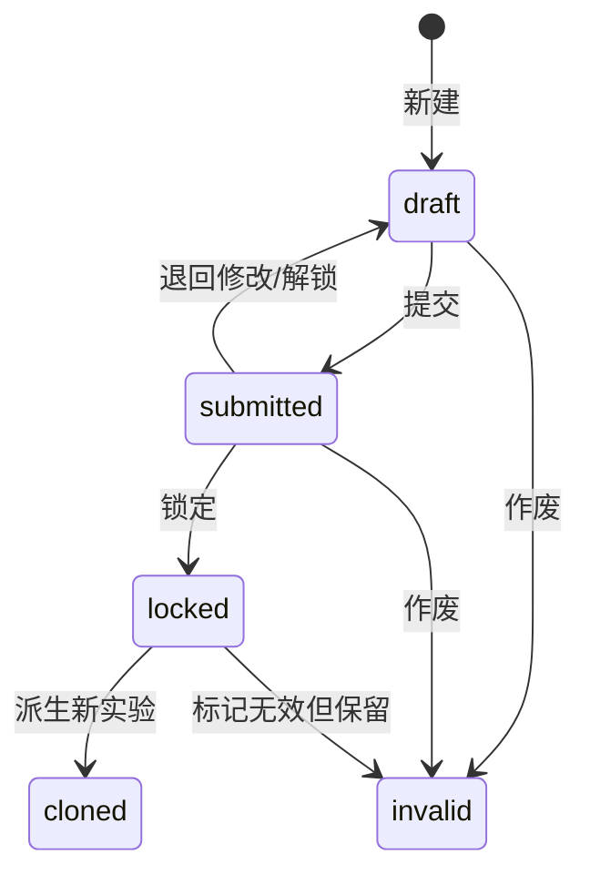
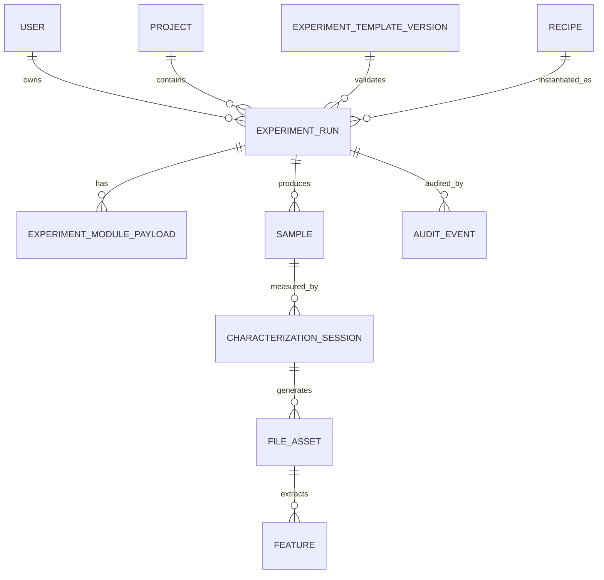

# CVD 实验数据采集系统 V1 设计文档

**文档版本**：v1.0  
**日期**：2026-04-22  
**适用范围**：二维材料 CVD 实验数据采集、样品记录、表征文件归档与后续 AI 分析准备  
**目标读者**：课题组负责人、实验人员、系统开发者、后续 AI Agent/数据分析开发者

---

## 目录

1. 项目概述
2. V1 范围
3. 用户角色与权限
4. 核心业务概念
5. 总体架构设计
6. 数据库设计
7. CVD V1 表单设计
8. 数据继承与复制设计
9. 前端页面设计
10. 后端 API 草案
11. 数据导出设计
12. 历史 Excel 导入设计
13. 校验规则与字段联动
14. 审计、版本与防误改
15. 样品与编号规则
16. 管理后台设计
17. MVP 研发计划
18. MVP 验收标准
19. 风险与应对
20. 后续 AI Agent 集成预留
21. 附录 A：CVD V1 模块 key 建议
22. 附录 B：数据库 DDL 草案
23. 附录 C：V1 优先级清单
24. 附录 D：第一版开发建议

---

## 1. 项目概述

### 1.1 背景

课题组当前通过 Excel 表格手动记录 CVD 实验数据。现有模板已经覆盖实验环境、实验前检查、前驱体、基底、温区、气体、光学/拉曼/PL/AFM/SEM 表征等核心字段。这个模板适合作为 V1 表单的字段来源，但不适合作为长期数据库结构直接照搬。

本系统的目标不是简单“网页化 Excel”，而是建立一个可持续演进的实验数据入口。V1 先解决组内日常记录、数据继承、误改防护和标准化导出；后续逐步支持样品追踪、文件资产化、图像/光谱特征提取、实验溯源和 AI Agent 集成。

### 1.2 建设目标

V1 系统需要满足以下目标：

1. **实验记录标准化**：用统一字段、单位、枚举和校验规则替代自由文本表格。
2. **填写体验优先**：支持复制上一条实验、Recipe 模板、自动保存、字段联动和差异对比。
3. **数据可追溯**：记录实验由谁创建、何时修改、是否从历史实验派生、何时提交锁定。
4. **结构可扩展**：CVD V1 是第一个模板，后续可以扩展到退火、转移、湿法处理、其他二维材料体系等。
5. **AI-ready**：导出 JSON/CSV/Parquet 友好的结构化数据，保留样品、原始文件和特征之间的关系。

### 1.3 V1 设计原则

- **先可用，再完美**：优先让 5 人以内小组立刻使用，避免一开始做成过重 LIMS。
- **核心字段固定，实验细节模块化**：实验 ID、用户、日期、状态、项目、材料体系等固定入表；前驱体、温区、气体等用模块化 JSON 管理。
- **模板版本不可覆盖**：表单字段变更时新增模板版本，老实验仍保持原始 schema。
- **实际记录与计划模板分离**：Recipe 表示“计划怎么做”，ExperimentRun 表示“实际发生了什么”。
- **文件不直接塞数据库**：数据库保存文件元数据、路径、哈希和关联关系；原始文件放对象存储或文件系统。

---

## 2. V1 范围

### 2.1 V1 必须包含

| 模块 | V1 功能 |
|---|---|
| 用户系统 | 登录、用户列表、实验归属、基础权限 |
| 实验记录 | 新建、编辑、复制、提交、锁定、作废 |
| CVD 表单 | 基本信息、环境检查、前驱体、基底、温区、气体、表征、备注 |
| 数据继承 | 复制上一条、从 Recipe 创建、从历史实验复制、差异提示 |
| 字段校验 | 必填、类型、单位、枚举、范围、条件字段 |
| 自动保存 | 草稿阶段自动保存，避免实验中断丢失 |
| 文件上传 | OM/Raman/PL/AFM/SEM 文件上传与元数据记录 |
| 数据导出 | 单实验 JSON、列表 CSV/Excel、批量 JSONL |
| 审计日志 | 创建、修改、提交、锁定、作废操作记录 |
| 管理配置 | 受控词表、Recipe、模板版本的基础管理 |

### 2.2 V1 暂不包含

| 功能 | 暂缓原因 | 后续阶段 |
|---|---|---|
| 自动图像识别 | 依赖图像数据积累和模型评估 | V2/V3 |
| 自动工艺推荐 | 需要足够历史数据和质量标签 | V3 |
| 多机构权限 | 目前为 5 人以内课题组 | 后续需要时扩展 |
| 复杂审批流 | 小组场景不需要 | 可用状态流替代 |
| 完整 ELN/LIMS | V1 聚焦 CVD 数据采集 | 长期演进 |
| 仪器自动采集 | 仪器接口差异大 | V2 之后评估 |

---

## 3. 用户角色与权限

### 3.1 用户角色

| 角色 | 说明 | 主要权限 |
|---|---|---|
| 普通实验人员 | 日常填写实验记录 | 创建自己的实验、编辑草稿、提交、导出自己的实验 |
| 课题组管理员 | 维护系统配置 | 管理用户、Recipe、字段字典、受控词表、查看全部实验 |
| 只读查看者 | 例如合作学生或 PI | 查看已提交/锁定实验，不能修改 |
| 系统管理员 | 部署和维护 | 数据库备份、恢复、系统配置 |

### 3.2 权限矩阵

| 操作 | 普通实验人员 | 课题组管理员 | 只读查看者 |
|---|---:|---:|---:|
| 创建实验 | 是 | 是 | 否 |
| 编辑自己的草稿 | 是 | 是 | 否 |
| 编辑他人草稿 | 否 | 可配置 | 否 |
| 查看他人已提交实验 | 可配置 | 是 | 是 |
| 锁定实验 | 自己提交后可锁定，或管理员锁定 | 是 | 否 |
| 作废实验 | 自己的实验可申请/执行 | 是 | 否 |
| 删除实验 | 不建议物理删除 | 不建议物理删除 | 否 |
| 管理 Recipe | 否 | 是 | 否 |
| 管理字段字典 | 否 | 是 | 否 |

### 3.3 数据状态流



状态定义：

| 状态 | 中文 | 说明 |
|---|---|---|
| `draft` | 草稿 | 可自动保存，可编辑 |
| `submitted` | 已提交 | 数据相对稳定，修改需要记录原因 |
| `locked` | 已锁定 | 用于论文、数据集、重要结论，不允许覆盖修改 |
| `invalid` | 作废 | 保留记录，不参与默认统计 |

---

## 4. 核心业务概念

### 4.1 概念关系



### 4.2 核心实体解释

| 实体 | 说明 |
|---|---|
| User | 系统用户，通常是组内实验人员 |
| Project | 课题或研究方向，例如 MoS2、WS2、hBN、graphene |
| ExperimentTemplateVersion | 表单模板版本，例如 `cvd_2zone_v1` |
| Recipe | 常用工艺模板，例如 `MoS2_2zone_standard_v1` |
| ExperimentRun | 一次真实实验记录 |
| ExperimentModulePayload | 某次实验下的模块数据，例如前驱体、温区、气体 |
| Sample | 样品、基底、产物或对照片 |
| CharacterizationSession | 一次表征记录，例如某片样品的一次 Raman 测试 |
| FileAsset | 原始文件或处理后文件 |
| Feature | 从文件或人工标注中提取出的结构化特征 |
| AuditEvent | 审计日志 |

---

## 5. 总体架构设计

### 5.1 推荐技术栈

| 层 | 推荐方案 | 说明 |
|---|---|---|
| 前端 | React / Vue + Ant Design / Naive UI | 适合快速做复杂表单和管理页面 |
| 后端 | FastAPI / Django REST Framework | FastAPI 更轻量；Django 管理后台更成熟 |
| 数据库 | PostgreSQL | 支持 JSONB、事务、索引、权限和后续扩展 |
| 文件存储 | 本地文件系统 / MinIO / S3 | V1 可先用本地路径，保留迁移到对象存储的接口 |
| 部署 | Docker Compose | 适合实验室服务器或工作站部署 |
| 数据导入导出 | pandas/openpyxl + 后端任务 | 处理历史 Excel、CSV、JSONL |
| 认证 | 本地账号密码 | V1 简单可靠；后续可接入学校统一身份认证 |

### 5.2 V1 部署拓扑

```text
Browser
  │
  ▼
Frontend Web App
  │ HTTPS / LAN HTTP
  ▼
Backend API
  ├── PostgreSQL: 结构化数据、JSONB、审计日志
  ├── File Storage: 原始图片、光谱、SEM/AFM 文件
  └── Export Worker: Excel/JSON/ZIP 导出
```

### 5.3 模块边界

| 模块 | 主要职责 |
|---|---|
| Auth | 登录、用户信息、角色 |
| Experiment | 实验记录主流程 |
| Template | 表单模板和 JSON Schema |
| Recipe | 工艺模板和默认值 |
| Sample | 样品 ID、基底和产物管理 |
| File | 文件上传、下载、哈希、元数据 |
| Export | JSON、CSV、Excel、ZIP 导出 |
| Admin | 字段字典、受控词表、用户管理 |
| Audit | 修改日志、状态变更记录 |

---

## 6. 数据库设计

### 6.1 设计策略

数据库采用“关系型主干 + JSONB 模块”的混合结构：

- 高频查询字段放入 `experiment_runs`、`samples` 等标准表。
- 变化快、结构不固定的实验细节放入 `experiment_module_payloads.payload_json`。
- 每个 payload 绑定 `schema_version`，使用 JSON Schema 校验。
- 后续常用分析字段可以做成派生表或物化视图，例如最高温度、保温时间、总流量、Raman 峰差等。

### 6.2 核心表：users

| 字段 | 类型 | 说明 |
|---|---|---|
| id | UUID | 用户 ID |
| name | text | 姓名 |
| email | text | 邮箱/登录名 |
| password_hash | text | 密码哈希 |
| role | enum | member/admin/viewer |
| is_active | bool | 是否启用 |
| created_at | timestamptz | 创建时间 |

### 6.3 核心表：projects

| 字段 | 类型 | 说明 |
|---|---|---|
| id | UUID | 项目 ID |
| name | text | 项目名称 |
| material_system | text | 材料体系，例如 MoS2、WS2 |
| description | text | 说明 |
| created_by | UUID | 创建人 |
| created_at | timestamptz | 创建时间 |

### 6.4 核心表：experiment_template_versions

| 字段 | 类型 | 说明 |
|---|---|---|
| id | UUID | 模板版本 ID |
| template_key | text | 例如 `cvd_2zone` |
| version | text | 例如 `v1` |
| display_name | text | 中文显示名 |
| schema_json | jsonb | 整体 JSON Schema 或模块 schema 索引 |
| form_config_json | jsonb | 前端表单渲染配置 |
| is_active | bool | 是否为当前默认模板 |
| created_at | timestamptz | 创建时间 |

### 6.5 核心表：recipes

| 字段 | 类型 | 说明 |
|---|---|---|
| id | UUID | Recipe ID |
| name | text | 例如 `MoS2_2zone_standard_v1` |
| template_version_id | UUID | 适用模板 |
| project_id | UUID | 所属项目，可为空 |
| material_system | text | 材料体系 |
| default_payload_json | jsonb | 默认模块参数 |
| description | text | 说明 |
| created_by | UUID | 创建人 |
| is_active | bool | 是否启用 |

### 6.6 核心表：experiment_runs

| 字段 | 类型 | 说明 |
|---|---|---|
| id | UUID | 系统 ID |
| run_code | text | 可读编号，例如 `CVD-2026-0001` |
| owner_id | UUID | 实验人员 |
| project_id | UUID | 项目 ID |
| template_version_id | UUID | 表单模板版本 |
| recipe_id | UUID | 来源 Recipe，可为空 |
| derived_from_run_id | UUID | 复制来源实验，可为空 |
| experiment_type | text | `cvd_2zone` 等 |
| material_system | text | 材料体系 |
| experiment_date | date | 实验日期 |
| objective | text | 实验目的 |
| status | enum | draft/submitted/locked/invalid |
| quality_label | enum | success/partial/failed/unknown |
| summary_result | text | 结果摘要 |
| created_at | timestamptz | 创建时间 |
| updated_at | timestamptz | 更新时间 |
| submitted_at | timestamptz | 提交时间 |
| locked_at | timestamptz | 锁定时间 |

### 6.7 核心表：experiment_module_payloads

| 字段 | 类型 | 说明 |
|---|---|---|
| id | UUID | 模块记录 ID |
| experiment_run_id | UUID | 所属实验 |
| module_key | text | `environment`、`precursors`、`gas_program` 等 |
| schema_version | text | 模块 schema 版本 |
| payload_json | jsonb | 模块数据 |
| validation_status | text | valid/warning/error |
| created_at | timestamptz | 创建时间 |
| updated_at | timestamptz | 更新时间 |

### 6.8 核心表：samples

| 字段 | 类型 | 说明 |
|---|---|---|
| id | UUID | 样品 ID |
| sample_code | text | 可读样品编号，例如 `S-2026-0001-A` |
| experiment_run_id | UUID | 来源实验 |
| parent_sample_id | UUID | 父样品，可为空 |
| role | text | top_substrate/bottom_substrate/product/control |
| substrate_type | text | 基底类型 |
| brand | text | 品牌 |
| size_mm | text | 尺寸，例如 `5x10` |
| treatment | text | 处理方式 |
| position_mm | numeric | 相对温区位置 |
| storage_location | text | 存放位置 |
| metadata_json | jsonb | 扩展信息 |

### 6.9 核心表：characterization_sessions

| 字段 | 类型 | 说明 |
|---|---|---|
| id | UUID | 表征记录 ID |
| sample_id | UUID | 所属样品 |
| experiment_run_id | UUID | 关联实验 |
| method | text | OM/Raman/PL/AFM/SEM |
| instrument | text | 仪器名称 |
| operator_id | UUID | 操作者 |
| acquisition_datetime | timestamptz | 采集时间 |
| acquisition_params_json | jsonb | 仪器参数 |
| region_json | jsonb | 表征区域 |
| note | text | 备注 |

### 6.10 核心表：file_assets

| 字段 | 类型 | 说明 |
|---|---|---|
| id | UUID | 文件 ID |
| experiment_run_id | UUID | 所属实验 |
| sample_id | UUID | 所属样品，可为空 |
| characterization_session_id | UUID | 所属表征，可为空 |
| file_category | text | raw/processed/report |
| method | text | OM/Raman/PL/AFM/SEM/other |
| original_filename | text | 原始文件名 |
| storage_uri | text | 存储路径 |
| sha256 | text | 文件哈希 |
| file_size_bytes | bigint | 文件大小 |
| mime_type | text | 文件类型 |
| metadata_json | jsonb | 文件元数据 |
| uploaded_by | UUID | 上传人 |
| created_at | timestamptz | 上传时间 |

### 6.11 核心表：features

| 字段 | 类型 | 说明 |
|---|---|---|
| id | UUID | 特征 ID |
| experiment_run_id | UUID | 关联实验 |
| sample_id | UUID | 关联样品 |
| source_file_id | UUID | 来源文件 |
| method | text | OM/Raman/PL/AFM/SEM |
| feature_key | text | 例如 `raman.peak_diff_cm-1` |
| value_number | numeric | 数值型特征 |
| value_text | text | 文本型特征 |
| unit | text | 单位 |
| algorithm_name | text | 算法名，可为空 |
| algorithm_version | text | 算法版本，可为空 |
| confidence | numeric | 置信度 |
| reviewed_by | UUID | 人工审核人 |
| created_at | timestamptz | 创建时间 |

### 6.12 核心表：audit_events

| 字段 | 类型 | 说明 |
|---|---|---|
| id | UUID | 审计 ID |
| actor_id | UUID | 操作者 |
| entity_type | text | 实体类型 |
| entity_id | UUID | 实体 ID |
| action | text | create/update/submit/lock/clone/invalidate |
| before_json | jsonb | 修改前 |
| after_json | jsonb | 修改后 |
| reason | text | 修改原因 |
| created_at | timestamptz | 操作时间 |

### 6.13 受控词表 controlled_vocabularies

| 字段 | 类型 | 说明 |
|---|---|---|
| id | UUID | 词条 ID |
| vocab_key | text | 词表类型，例如 `substrate_type` |
| value | text | 机器值 |
| label_zh | text | 中文名 |
| label_en | text | 英文名 |
| sort_order | int | 排序 |
| is_active | bool | 是否启用 |
| metadata_json | jsonb | 扩展信息 |

---

## 7. CVD V1 表单设计

### 7.1 表单模块

V1 表单拆分为以下模块：

| 顺序 | 模块 key | 中文名 | 说明 |
|---:|---|---|---|
| 1 | `basic_info` | 基本信息 | 实验日期、人员、项目、材料体系、目的 |
| 2 | `environment` | 实验环境 | 室温、湿度、制样环境、异常备注 |
| 3 | `precheck` | 实验前检查 | 通风橱、法兰、瓷舟、石英管、密封圈 |
| 4 | `precursors` | 前驱体 | 多个前驱体数组，不固定 A/B |
| 5 | `substrates` | 基底与样品 | 上/下基底、尺寸、处理、位置 |
| 6 | `furnace_program` | 温区程序 | 温区数量、时间-温度曲线、是否放前驱体 |
| 7 | `gas_program` | 气体程序 | 洗气、生长、冷却等阶段气体流量 |
| 8 | `process_observation` | 实验过程观察 | 颜色变化、异常、实际偏差 |
| 9 | `characterization` | 表征记录 | OM/Raman/PL/AFM/SEM 状态和文件 |
| 10 | `result_summary` | 结果总结 | 质量标签、结论、下一步建议 |

### 7.2 基本信息字段

| 字段 key | 中文名 | 类型/单位 | 规则 |
|---|---|---|---|
| `operator_id` | 实验人员 | user | 默认当前用户，不可空 |
| `experiment_date` | 实验日期 | date | 默认当天，不可空 |
| `project_id` | 项目 | select | 可为空，但建议填写 |
| `material_system` | 材料体系 | select/text | 例如 MoS2、WS2、hBN |
| `objective` | 实验目的 | textarea | 建议填写 |
| `recipe_id` | 使用 Recipe | select | 可选 |
| `derived_from_run_id` | 派生来源 | run_id | 系统自动填充 |

### 7.3 环境字段

| 字段 key | 中文名 | 类型/单位 | 默认策略 | 规则 |
|---|---|---|---|---|
| `indoor_temperature_C` | 室内温度 | number/℃ | 手动填写 | 建议范围 15-35 |
| `indoor_humidity_percent` | 室内湿度 | number/%RH | 手动填写 | 建议范围 0-100 |
| `sample_env` | 制样环境 | enum | 默认“干净” | 干净/一般/污染/未知 |
| `abnormal_note` | 非常规操作备注 | textarea | 不继承 | 有异常时必填 |

### 7.4 实验前检查字段

| 字段 key | 中文名 | 类型 | 规则 |
|---|---|---|---|
| `hood_clean` | 通风橱是否洁净 | enum | 干净/一般/污染 |
| `flange_blocked` | 法兰出气口是否堵塞 | boolean | 是/否 |
| `boat_contamination_level` | 瓷舟污染程度 | integer | 0-5 |
| `tube_contamination_level` | 石英管污染程度 | integer | 0-5 |
| `seal_intact` | 密封圈是否完好 | boolean | 否时必须备注 |
| `precheck_note` | 检查备注 | textarea | 可选 |

风险提示规则：

- `flange_blocked = true`：红色提示“法兰出气口堵塞可能影响气氛与安全，请确认是否继续”。
- `seal_intact = false`：红色提示“密封圈异常，建议停止实验或更换”。
- `tube_contamination_level >= 4`：黄色提示“石英管污染较重，可能影响重复性”。

### 7.5 前驱体模块

前驱体不固定为 A/B，而是数组结构：

```json
{
  "precursors": [
    {
      "role": "A",
      "chemical_name": "MoO3",
      "brand": "Aladdin",
      "concentration": null,
      "concentration_unit": null,
      "preparation_method": "熔融",
      "melting_temperature_C": 80,
      "spin_speed_rpm": null,
      "pre_spin_rpm": null,
      "preparation_time_min": null,
      "mass_mg": 10,
      "batch_no": "optional",
      "note": ""
    }
  ]
}
```

字段规则：

| 字段 | 说明 | 规则 |
|---|---|---|
| `role` | A/B/C 或自定义 | 默认 A/B，可新增 |
| `chemical_name` | 前驱体种类 | 必填 |
| `brand` | 品牌 | 建议填写 |
| `concentration` | 浓度 | 有溶液时填写 |
| `preparation_method` | 制样方式 | 熔融/旋涂/研磨/称量/其他 |
| `melting_temperature_C` | 熔融温度 | 方法为熔融时显示 |
| `spin_speed_rpm` | 旋涂转速 | 方法为旋涂时显示 |
| `preparation_time_min` | 制样时间 | 旋涂/预处理时显示 |
| `mass_mg` | 质量 | 建议填写 |
| `batch_no` | 批号 | 建议填写，便于复盘 |

### 7.6 基底模块

基底用数组管理，通过 `role` 区分上/下基底：

```json
{
  "substrates": [
    {
      "role": "top",
      "substrate_type": "硅片单抛N<100>",
      "brand": "华赫硅材料",
      "size_mm": "5x10",
      "treatment_method": "等离子清洗",
      "treatment_params": {
        "temperature_C": null,
        "duration_min": 5,
        "power_W": 100
      },
      "position_mm": 1
    },
    {
      "role": "bottom",
      "substrate_type": "硅片单抛N<100>",
      "brand": "合肥科晶",
      "size_mm": "5x10",
      "treatment_method": "等离子清洗",
      "position_mm": -1
    }
  ]
}
```

字段规则：

| 字段 | 说明 | 规则 |
|---|---|---|
| `role` | top/bottom/control/product | 必填 |
| `substrate_type` | 基底类型 | 必填，受控词表 |
| `brand` | 品牌 | 建议填写 |
| `size_mm` | 尺寸 | 统一 mm |
| `treatment_method` | 处理方式 | 无/等离子清洗/紫外清洗/退火 |
| `treatment_params` | 温度/时长/功率等 | 根据处理方式显示 |
| `position_mm` | 相对温区位置 | -2/-1/0/1/2；无则为空 |

### 7.7 温区程序模块

不要把温度变化存成自由字符串，应存为结构化曲线：

```json
{
  "zones": [
    {
      "zone_index": 1,
      "contains_precursor": true,
      "temperature_program": [
        {"time_min": 0, "temperature_C": 25},
        {"time_min": 30, "temperature_C": 750},
        {"time_min": 45, "temperature_C": 750},
        {"time_min": 90, "temperature_C": 25}
      ],
      "note": ""
    },
    {
      "zone_index": 2,
      "contains_precursor": true,
      "temperature_program": [
        {"time_min": 0, "temperature_C": 25},
        {"time_min": 30, "temperature_C": 200}
      ]
    }
  ]
}
```

前端建议同时提供两种输入方式：

1. **表格输入**：time/min 与 temperature/℃ 两列，可增删行。
2. **快速文本输入**：允许用户输入 `0min-25C;30min-750C;45min-750C`，系统解析成结构化数组。

系统自动计算：

- 最高温度
- 最低温度
- 升温速率
- 保温时长
- 总时长
- 温区间温差

### 7.8 气体程序模块

气体记录不要固定成 `gas_Ar_flow`、`gas_CO2_flow` 等列，而是分阶段记录：

```json
{
  "gas_segments": [
    {
      "stage": "pre_washing",
      "start_min": -10,
      "end_min": 0,
      "gas_label": "Ar+H2",
      "components": [
        {"name": "Ar", "flow_sccm": 95},
        {"name": "H2", "flow_sccm": 5}
      ],
      "flow_sccm": 100,
      "note": ""
    },
    {
      "stage": "growth",
      "start_min": 0,
      "end_min": 45,
      "gas_label": "Ar",
      "components": [{"name": "Ar", "flow_sccm": 80}],
      "flow_sccm": 80
    }
  ]
}
```

字段规则：

| 字段 | 说明 | 规则 |
|---|---|---|
| `stage` | 阶段 | pre_washing/growth/cooling/other |
| `start_min` | 开始时间 | 可为负数，表示实验前洗气 |
| `end_min` | 结束时间 | 应大于开始时间 |
| `gas_label` | 气体标签 | 例如 Ar、Ar+H2 |
| `components` | 组成 | 结构化记录，每个组件包含 name + flow_sccm（用户填写流量），fraction 由后端自动计算 |
| `flow_sccm` | 流量 | 单位 sccm；若 components 存在则自动设为各组件流量之和 |

### 7.9 表征模块

表征记录分为“是否计划/是否完成”和“文件上传/特征提取”两层。

| 方法 | V1 字段 | V2/V3 扩展 |
|---|---|---|
| OM | 是否完成、文件、备注、面积人工填写 | 自动分割面积、形貌分类 |
| Raman-532 | 是否完成、文件、峰位人工填写 | 自动读谱、峰拟合 |
| Raman-633 | 是否完成、文件、峰位人工填写 | 自动读谱、峰拟合 |
| PL-532 | 是否完成、文件、峰位/强度 | 自动峰提取 |
| PL-633 | 是否完成、文件、峰位/强度 | 自动峰提取 |
| AFM | 是否完成、文件、厚度 | 自动台阶高度识别 |
| SEM | 是否完成、文件、备注 | 晶粒尺寸/缺陷提取 |

V1 中可以先让用户手动输入少量关键特征：

| 特征 key | 说明 | 单位 |
|---|---|---|
| `om.area_um2` | 光学面积 | μm² |
| `om.domain_count` | 晶畴数量 | count |
| `raman.e2g_peak_cm-1` | Raman E2g 峰位 | cm⁻¹ |
| `raman.a1g_peak_cm-1` | Raman A1g 峰位 | cm⁻¹ |
| `raman.peak_diff_cm-1` | 峰差 | cm⁻¹ |
| `pl.peak_nm` | PL 峰位 | nm |
| `pl.intensity_a.u.` | PL 强度 | a.u. |
| `afm.thickness_nm` | AFM 厚度 | nm |

---

## 8. 数据继承与复制设计

### 8.1 新建实验入口

新建实验时提供四个入口：

1. **空白新建**：从当前模板默认值开始。
2. **复制我的上一条实验**：最常用入口。
3. **从 Recipe 创建**：适合标准工艺。
4. **从历史实验复制**：用户搜索并选择任意历史实验作为来源。

### 8.2 复制逻辑

复制时：

- 复制实验参数，但不复制实验日期、结果总结、异常备注、表征文件、质量标签。
- 自动填充 `derived_from_run_id`。
- 新实验状态为 `draft`。
- 页面顶部显示来源实验和差异提示。

### 8.3 字段默认策略

| 字段类型 | 默认策略 |
|---|---|
| 用户、日期 | 当前用户、当天日期 |
| 环境字段 | 可继承，但建议重新确认 |
| 前驱体种类 | 可继承 |
| 前驱体批号/质量 | 建议重新确认 |
| 温区程序 | 可继承自 Recipe 或历史实验 |
| 气体程序 | 可继承自 Recipe 或历史实验 |
| 样品位置 | 可继承但高亮确认 |
| 异常备注 | 不继承 |
| 表征结果 | 不继承 |
| 文件 | 不继承 |
| 质量标签 | 不继承 |

### 8.4 差异对比

复制历史实验后，系统应支持与来源实验对比：

```text
来源实验：CVD-2026-0012
当前实验：CVD-2026-0013

变更项：
- 前驱体 A: MoO3 -> WO3
- 温区1最高温度: 750 ℃ -> 800 ℃
- Ar流量: 80 sccm -> 100 sccm
- 上基底位置: 1 mm -> 3 mm
```

### 8.5 Recipe 与 Experiment 的关系

Recipe 是工艺模板，Experiment 是真实记录。

| 对比项 | Recipe | ExperimentRun |
|---|---|---|
| 代表 | 计划/标准流程 | 实际执行记录 |
| 是否有实验日期 | 否 | 是 |
| 是否有表征结果 | 否 | 是 |
| 是否可被多次引用 | 是 | 可被复制但不是模板 |
| 是否可锁定 | 可版本化 | 可提交/锁定 |

---

## 9. 前端页面设计

### 9.1 页面列表

| 页面 | 路径示例 | 说明 |
|---|---|---|
| 登录页 | `/login` | 本地账号登录 |
| 我的实验 | `/experiments` | 列表、筛选、搜索、复制 |
| 新建实验 | `/experiments/new` | 选择创建方式 |
| 实验编辑 | `/experiments/:id/edit` | 向导式表单 |
| 实验详情 | `/experiments/:id` | 只读详情、导出、文件 |
| 文件管理 | `/experiments/:id/files` | 上传和管理文件 |
| 样品详情 | `/samples/:id` | 样品、表征、文件和特征 |
| Recipe 管理 | `/recipes` | 管理员维护常用工艺 |
| 字段字典 | `/admin/fields` | 管理员维护字段与校验 |
| 受控词表 | `/admin/vocabularies` | 管理枚举值 |

### 9.2 我的实验列表

列表字段：

- 实验编号
- 日期
- 实验人员
- 项目
- 材料体系
- 状态
- 来源 Recipe
- 质量标签
- 更新时间
- 操作：查看 / 编辑 / 复制 / 导出 / 作废

筛选项：

- 我的/全部
- 日期范围
- 材料体系
- 实验状态
- 质量标签
- 是否有 OM/Raman/AFM 文件
- 关键词搜索

### 9.3 实验编辑页面

采用左侧步骤导航 + 右侧表单的向导式页面：

```text
[基本信息]
[环境与检查]
[前驱体]
[基底]
[温区]
[气体]
[过程观察]
[表征与文件]
[结果总结]
[提交]
```

交互要求：

- 每个模块独立保存。
- 页面显示自动保存状态。
- 模块有错误时左侧标红。
- 高风险字段修改后要求确认。
- 提交前统一校验所有模块。

### 9.4 文件上传页面

功能：

- 拖拽上传多个文件。
- 选择文件对应的样品和表征方法。
- 自动记录文件名、大小、哈希、上传人、上传时间。
- 支持文件备注。
- 支持后续追加特征。

上传路径建议：

```text
/storage/
  experiments/
    CVD-2026-0001/
      raw/
      processed/
      reports/
```

---

## 10. 后端 API 草案

### 10.1 Auth

| 方法 | 路径 | 说明 |
|---|---|---|
| POST | `/api/auth/login` | 登录 |
| POST | `/api/auth/logout` | 退出 |
| GET | `/api/auth/me` | 当前用户 |

### 10.2 Experiments

| 方法 | 路径 | 说明 |
|---|---|---|
| GET | `/api/experiments` | 查询实验列表 |
| POST | `/api/experiments` | 新建空白实验 |
| POST | `/api/experiments/from-recipe` | 从 Recipe 新建 |
| POST | `/api/experiments/{id}/clone` | 复制历史实验 |
| GET | `/api/experiments/{id}` | 实验详情 |
| PATCH | `/api/experiments/{id}` | 更新实验主信息 |
| POST | `/api/experiments/{id}/submit` | 提交实验 |
| POST | `/api/experiments/{id}/lock` | 锁定实验 |
| POST | `/api/experiments/{id}/invalidate` | 作废实验 |

### 10.3 Module Payloads

| 方法 | 路径 | 说明 |
|---|---|---|
| GET | `/api/experiments/{id}/modules` | 获取所有模块 |
| GET | `/api/experiments/{id}/modules/{module_key}` | 获取单模块 |
| PUT | `/api/experiments/{id}/modules/{module_key}` | 保存单模块 |
| POST | `/api/experiments/{id}/validate` | 校验整条实验 |
| GET | `/api/experiments/{id}/diff/{source_id}` | 与来源实验对比 |

### 10.4 Samples

| 方法 | 路径 | 说明 |
|---|---|---|
| GET | `/api/samples` | 查询样品 |
| POST | `/api/experiments/{id}/samples` | 创建样品 |
| GET | `/api/samples/{id}` | 样品详情 |
| PATCH | `/api/samples/{id}` | 更新样品 |

### 10.5 Files

| 方法 | 路径 | 说明 |
|---|---|---|
| POST | `/api/files/upload` | 上传文件 |
| GET | `/api/files/{id}` | 文件详情 |
| GET | `/api/files/{id}/download` | 下载文件 |
| DELETE | `/api/files/{id}` | 删除/标记删除文件 |

### 10.6 Export

| 方法 | 路径 | 说明 |
|---|---|---|
| GET | `/api/experiments/{id}/export/json` | 单实验完整 JSON |
| GET | `/api/experiments/{id}/export/excel` | 单实验 Excel |
| POST | `/api/exports/experiments/jsonl` | 批量 JSONL |
| POST | `/api/exports/experiments/csv` | 批量 CSV |
| POST | `/api/exports/dataset-zip` | 数据集 ZIP |

---

## 11. 数据导出设计

### 11.1 单实验 JSON

用于 AI Agent、调试、归档和完整溯源。

```json
{
  "experiment": {
    "run_code": "CVD-2026-0001",
    "template_key": "cvd_2zone",
    "template_version": "v1",
    "operator": "name",
    "experiment_date": "2026-04-22",
    "material_system": "MoS2",
    "status": "locked"
  },
  "modules": {
    "environment": {},
    "precheck": {},
    "precursors": {},
    "substrates": {},
    "furnace_program": {},
    "gas_program": {},
    "characterization": {}
  },
  "samples": [],
  "files": [],
  "features": [],
  "provenance": {
    "derived_from_run_code": "CVD-2026-0000",
    "created_by": "name",
    "created_at": "2026-04-22T10:00:00"
  }
}
```

### 11.2 批量 JSONL

适合 AI pipeline：一行一个实验。

```jsonl
{"run_code":"CVD-2026-0001","material_system":"MoS2","modules":{...}}
{"run_code":"CVD-2026-0002","material_system":"WS2","modules":{...}}
```

### 11.3 分析用长表 CSV/Parquet

将实验参数和特征展开成长表：

| run_code | sample_code | feature_key | value | unit | source |
|---|---|---|---:|---|---|
| CVD-2026-0001 | S-2026-0001-A | `zone1.max_temperature` | 750 | ℃ | furnace_program |
| CVD-2026-0001 | S-2026-0001-A | `gas.Ar.component_flow_sccm` | 80 | sccm | gas_program |
| CVD-2026-0001 | S-2026-0001-A | `afm.thickness_nm` | 0.7 | nm | AFM |

### 11.4 Excel 导出

V1 仍保留 Excel 导出，面向人类查看：

- Sheet 1：实验基本信息
- Sheet 2：环境与检查
- Sheet 3：前驱体
- Sheet 4：基底
- Sheet 5：温区程序
- Sheet 6：气体程序
- Sheet 7：表征与文件
- Sheet 8：特征表

---

## 12. 历史 Excel 导入设计

### 12.1 导入流程

1. 上传历史 Excel/CSV。
2. 系统读取表头。
3. 根据字段字典自动匹配字段 key。
4. 用户确认无法识别的字段。
5. 系统执行单位转换和枚举清洗。
6. 生成导入预览和错误报告。
7. 用户确认后写入数据库。

### 12.2 导入错误类型

| 错误类型 | 示例 | 处理方式 |
|---|---|---|
| 未识别字段 | `PL-633ex` 重复 | 人工映射 |
| 单位不明 | `750度` | 解析为 750 ℃ 并提示确认 |
| 枚举不一致 | `硅片N100`、`硅片单抛N<100>` | 映射到同一受控词 |
| 数值范围异常 | 湿度 180 | 阻止导入或标记错误 |
| 结构化失败 | 温度曲线自由文本 | 保存原文并提示手动修正 |

### 12.3 保留原始数据

导入历史数据时，建议在每条实验中保留 `legacy_raw_json`，避免清洗过程中信息丢失。

---

## 13. 校验规则与字段联动

### 13.1 通用校验

| 类型 | 规则 |
|---|---|
| 必填 | 实验日期、实验人员、模板版本、至少一个温区程序 |
| 数值 | 温度、湿度、流量、时间、位置必须为数值 |
| 范围 | 湿度 0-100，流量 >=0，温度范围可配置 |
| 单位 | 前端显示单位，后端存标准单位 |
| 枚举 | 基底、气体、处理方式、表征方法使用受控词表 |
| 条件必填 | `seal_intact=false` 时必须填写备注 |

### 13.2 字段联动示例

| 条件 | 联动 |
|---|---|
| 前驱体制样方式 = 熔融 | 显示熔融温度 |
| 前驱体制样方式 = 旋涂 | 显示转速、预转、时间 |
| 基底处理方式 = 等离子清洗 | 显示功率、时间、气体 |
| 气体标签 = 混合气体 | 显示 components 组分编辑器（每组分填写流量 sccm，占比自动计算） |
| 表征方法 = Raman | 显示激发波长、积分时间、峰位字段 |
| 表征方法 = AFM | 显示扫描尺寸、厚度字段 |

### 13.3 提交前校验

提交实验时，系统检查：

- 必填字段是否完成。
- 前驱体数组是否至少包含一个记录。
- 温区程序时间是否递增。
- 气体阶段是否有时间重叠。
- 高风险检查项是否有备注。
- 已上传文件是否已选择样品/方法。

---

## 14. 审计、版本与防误改

### 14.1 修改审计

每次保存模块时记录：

- 谁修改
- 修改时间
- 修改模块
- 修改前 JSON
- 修改后 JSON
- 修改原因，可选

### 14.2 锁定机制

实验进入 `locked` 状态后：

- 不允许直接修改实验参数。
- 如需修改，只能“创建修订版本”或“克隆为新实验”。
- 管理员可标记为 invalid，但不物理删除。

### 14.3 删除策略

不建议物理删除实验记录。V1 可提供：

- 普通用户：作废自己的实验。
- 管理员：恢复作废实验。
- 系统管理员：数据库层面清理测试数据。

---

## 15. 样品与编号规则

### 15.1 实验编号

建议格式：

```text
CVD-YYYY-NNNN
```

例如：

```text
CVD-2026-0001
```

### 15.2 样品编号

建议格式：

```text
S-YYYY-NNNN-A
```

其中：

- `YYYY`：年份
- `NNNN`：实验序号
- `A/B/C`：样品序号或角色

示例：

```text
S-2026-0001-TOP
S-2026-0001-BOTTOM
S-2026-0001-PRODUCT-A
```

### 15.3 QR code

V1 可以先不做打印，但数据库应预留 `sample_code`，方便后续生成 QR code。

QR code 对应 URL：

```text
https://your-lab-app/samples/S-2026-0001-A
```

---

## 16. 管理后台设计

### 16.1 用户管理

功能：

- 创建用户
- 禁用用户
- 修改角色
- 重置密码

### 16.2 受控词表管理

词表类型：

| 词表 key | 示例 |
|---|---|
| `material_system` | MoS2、WS2、hBN、Graphene |
| `substrate_type` | 硅片单抛N<100>、蓝宝石单抛<0001>/<11-20>、蓝宝石双抛C<0001> |
| `substrate_brand` | 华赫硅材料、合肥科晶、苏州研材微纳科技 |
| `substrate_size` | 5x5、5x8、5x10、10x10 |
| `precursor_chemical` | MoO3、WO3、S、Se |
| `preparation_method` | 熔融、旋涂、称量、研磨 |
| `gas` | Ar、H2、CO2、O2、CO |
| `treatment_method` | 无、等离子清洗、紫外清洗、退火 |
| `characterization_method` | OM、Raman、PL、AFM、SEM |

### 16.3 Recipe 管理

Recipe 管理功能：

- 新建 Recipe
- 从已有实验保存为 Recipe
- 编辑 Recipe
- 停用 Recipe
- 查看 Recipe 被哪些实验使用

Recipe 字段：

- 名称
- 材料体系
- 适用模板
- 前驱体默认值
- 基底默认值
- 温区程序默认值
- 气体程序默认值
- 备注

---

## 17. MVP 研发计划

### 17.1 第 1 周：字段字典与原型

交付物：

- 字段字典 v0.1
- CVD V1 JSON Schema
- 页面原型
- 数据库 ERD
- Docker Compose 初版

### 17.2 第 2-3 周：基础后端与数据库

交付物：

- 用户登录
- 实验主表
- 模块 payload 保存
- 审计日志
- Recipe 基础接口
- JSON/Excel 导出基础版

### 17.3 第 4-5 周：前端表单

交付物：

- 我的实验列表
- 新建入口
- 向导式表单
- 自动保存
- 字段校验
- 复制上一条实验
- 提交/锁定

### 17.4 第 6 周：文件上传与试用

交付物：

- 文件上传
- 表征模块
- 管理后台基础版
- 测试数据导入
- 组内试用
- 修复反馈

---

## 18. MVP 验收标准

### 18.1 功能验收

| 编号 | 验收项 | 标准 |
|---|---|---|
| A1 | 用户登录 | 5 人以内账号可登录，权限正确 |
| A2 | 创建实验 | 可从空白、Recipe、上一条实验创建 |
| A3 | 表单保存 | 每个模块可保存，刷新后数据不丢失 |
| A4 | 自动保存 | 编辑过程中自动保存草稿 |
| A5 | 字段校验 | 必填、类型、范围、条件字段有效 |
| A6 | 复制实验 | 复制后保留来源 ID，不复制结果和文件 |
| A7 | 提交锁定 | 已锁定实验不能被普通编辑覆盖 |
| A8 | 文件上传 | 文件能上传、关联实验/样品、下载 |
| A9 | 导出 JSON | 单实验可导出完整 JSON |
| A10 | 导出 Excel | 单实验可导出人类可读 Excel |
| A11 | 审计日志 | 修改和状态变化有记录 |

### 18.2 数据验收

| 编号 | 验收项 | 标准 |
|---|---|---|
| D1 | 单位统一 | 温度、时间、流量、位置单位标准化 |
| D2 | 枚举统一 | 基底、气体、处理方式来自词表 |
| D3 | 温区结构化 | 温度曲线不再只存自由文本 |
| D4 | 气体结构化 | 支持多阶段、多气体组成 |
| D5 | 前驱体可扩展 | 支持超过两个前驱体 |
| D6 | 样品可追踪 | 表征文件可关联样品 |

### 18.3 使用验收

| 编号 | 验收项 | 标准 |
|---|---|---|
| U1 | 填写速度 | 复制上一条后，常规实验 3-5 分钟内完成主要参数 |
| U2 | 易用性 | 实验人员不看说明也能完成一次记录 |
| U3 | 错误可见 | 未填和高风险字段有明确提示 |
| U4 | 导出可用 | 导出的 JSON/Excel 能被课题组直接使用 |

---

## 19. 风险与应对

| 风险 | 表现 | 应对 |
|---|---|---|
| 字段过多导致没人愿意填 | 表单太长 | 分步骤、默认值、复制上一条、必填最小化 |
| 自由文本过多 | 后续分析困难 | 使用受控词表和结构化字段 |
| 过早追求通用系统 | 开发周期过长 | V1 只支持 CVD，架构上保留扩展 |
| 文件和实验对不上 | 只用文件名关联 | 引入 sample_code、file_asset、sha256 |
| 模板频繁变化 | 老数据无法解释 | 模板版本化，不覆盖历史 schema |
| 用户误改数据 | 已提交记录被覆盖 | 状态流 + 审计日志 + 锁定机制 |
| AI 分析数据不够干净 | 单位混乱、字段缺失 | 字段字典、校验、导出前数据质量检查 |

---

## 20. 后续 AI Agent 集成预留

### 20.1 AI 能力方向

| 方向 | 需要的数据基础 |
|---|---|
| 实验检索问答 | 完整 JSON、字段字典、实验摘要 |
| 相似实验搜索 | 结构化参数、特征向量、质量标签 |
| 失败原因归因 | 异常备注、环境、检查项、结果标签 |
| 工艺参数推荐 | 大量成功/失败样本、Recipe、质量特征 |
| 多模态分析 | 样品、图像、光谱、特征和实验参数关联 |
| 溯源分析 | derived_from、sample parent、file sha256、audit log |

### 20.2 AI-ready 导出接口

建议预留：

```text
GET /api/ai/experiments/{id}/context
GET /api/ai/experiments/search?material_system=MoS2
GET /api/ai/samples/{id}/multimodal-context
POST /api/ai/export-dataset
```

### 20.3 AI 上下文结构

AI Agent 读取单实验时，建议返回：

- 实验主信息
- 模块化参数
- 派生特征
- 文件列表和摘要
- 相关历史实验
- 与 Recipe 的差异
- 审计和溯源关系

---

## 21. 附录 A：CVD V1 模块 key 建议

| 模块 key | 说明 | 存储方式 |
|---|---|---|
| `basic_info` | 基本信息 | 部分在主表，部分 JSON |
| `environment` | 环境 | JSONB |
| `precheck` | 实验前检查 | JSONB |
| `precursors` | 前驱体数组 | JSONB |
| `substrates` | 基底数组 | JSONB + samples 表 |
| `furnace_program` | 温区程序 | JSONB |
| `gas_program` | 气体程序 | JSONB |
| `process_observation` | 过程观察 | JSONB |
| `characterization` | 表征计划/结果 | JSONB + characterization_sessions 表 |
| `result_summary` | 结果总结 | 主表 + JSONB |

---

## 22. 附录 B：数据库 DDL 草案

```sql
CREATE TABLE users (
    id UUID PRIMARY KEY,
    name TEXT NOT NULL,
    email TEXT UNIQUE NOT NULL,
    password_hash TEXT NOT NULL,
    role TEXT NOT NULL DEFAULT 'member',
    is_active BOOLEAN NOT NULL DEFAULT TRUE,
    created_at TIMESTAMPTZ NOT NULL DEFAULT now()
);

CREATE TABLE projects (
    id UUID PRIMARY KEY,
    name TEXT NOT NULL,
    material_system TEXT,
    description TEXT,
    created_by UUID REFERENCES users(id),
    created_at TIMESTAMPTZ NOT NULL DEFAULT now()
);

CREATE TABLE experiment_template_versions (
    id UUID PRIMARY KEY,
    template_key TEXT NOT NULL,
    version TEXT NOT NULL,
    display_name TEXT NOT NULL,
    schema_json JSONB NOT NULL,
    form_config_json JSONB NOT NULL DEFAULT '{}'::jsonb,
    is_active BOOLEAN NOT NULL DEFAULT TRUE,
    created_at TIMESTAMPTZ NOT NULL DEFAULT now(),
    UNIQUE(template_key, version)
);

CREATE TABLE recipes (
    id UUID PRIMARY KEY,
    name TEXT NOT NULL,
    template_version_id UUID REFERENCES experiment_template_versions(id),
    project_id UUID REFERENCES projects(id),
    material_system TEXT,
    default_payload_json JSONB NOT NULL DEFAULT '{}'::jsonb,
    description TEXT,
    created_by UUID REFERENCES users(id),
    is_active BOOLEAN NOT NULL DEFAULT TRUE,
    created_at TIMESTAMPTZ NOT NULL DEFAULT now()
);

CREATE TABLE experiment_runs (
    id UUID PRIMARY KEY,
    run_code TEXT UNIQUE NOT NULL,
    owner_id UUID REFERENCES users(id),
    project_id UUID REFERENCES projects(id),
    template_version_id UUID REFERENCES experiment_template_versions(id),
    recipe_id UUID REFERENCES recipes(id),
    derived_from_run_id UUID REFERENCES experiment_runs(id),
    experiment_type TEXT NOT NULL,
    material_system TEXT,
    experiment_date DATE NOT NULL,
    objective TEXT,
    status TEXT NOT NULL DEFAULT 'draft',
    quality_label TEXT NOT NULL DEFAULT 'unknown',
    summary_result TEXT,
    created_at TIMESTAMPTZ NOT NULL DEFAULT now(),
    updated_at TIMESTAMPTZ NOT NULL DEFAULT now(),
    submitted_at TIMESTAMPTZ,
    locked_at TIMESTAMPTZ
);

CREATE TABLE experiment_module_payloads (
    id UUID PRIMARY KEY,
    experiment_run_id UUID NOT NULL REFERENCES experiment_runs(id) ON DELETE CASCADE,
    module_key TEXT NOT NULL,
    schema_version TEXT NOT NULL,
    payload_json JSONB NOT NULL DEFAULT '{}'::jsonb,
    validation_status TEXT NOT NULL DEFAULT 'valid',
    created_at TIMESTAMPTZ NOT NULL DEFAULT now(),
    updated_at TIMESTAMPTZ NOT NULL DEFAULT now(),
    UNIQUE(experiment_run_id, module_key)
);

CREATE TABLE samples (
    id UUID PRIMARY KEY,
    sample_code TEXT UNIQUE NOT NULL,
    experiment_run_id UUID REFERENCES experiment_runs(id),
    parent_sample_id UUID REFERENCES samples(id),
    role TEXT NOT NULL,
    substrate_type TEXT,
    brand TEXT,
    size_mm TEXT,
    treatment TEXT,
    position_mm NUMERIC,
    storage_location TEXT,
    metadata_json JSONB NOT NULL DEFAULT '{}'::jsonb
);

CREATE TABLE characterization_sessions (
    id UUID PRIMARY KEY,
    sample_id UUID REFERENCES samples(id),
    experiment_run_id UUID REFERENCES experiment_runs(id),
    method TEXT NOT NULL,
    instrument TEXT,
    operator_id UUID REFERENCES users(id),
    acquisition_datetime TIMESTAMPTZ,
    acquisition_params_json JSONB NOT NULL DEFAULT '{}'::jsonb,
    region_json JSONB NOT NULL DEFAULT '{}'::jsonb,
    note TEXT
);

CREATE TABLE file_assets (
    id UUID PRIMARY KEY,
    experiment_run_id UUID REFERENCES experiment_runs(id),
    sample_id UUID REFERENCES samples(id),
    characterization_session_id UUID REFERENCES characterization_sessions(id),
    file_category TEXT NOT NULL DEFAULT 'raw',
    method TEXT,
    original_filename TEXT NOT NULL,
    storage_uri TEXT NOT NULL,
    sha256 TEXT NOT NULL,
    file_size_bytes BIGINT,
    mime_type TEXT,
    metadata_json JSONB NOT NULL DEFAULT '{}'::jsonb,
    uploaded_by UUID REFERENCES users(id),
    created_at TIMESTAMPTZ NOT NULL DEFAULT now()
);

CREATE TABLE features (
    id UUID PRIMARY KEY,
    experiment_run_id UUID REFERENCES experiment_runs(id),
    sample_id UUID REFERENCES samples(id),
    source_file_id UUID REFERENCES file_assets(id),
    method TEXT,
    feature_key TEXT NOT NULL,
    value_number NUMERIC,
    value_text TEXT,
    unit TEXT,
    algorithm_name TEXT,
    algorithm_version TEXT,
    confidence NUMERIC,
    reviewed_by UUID REFERENCES users(id),
    created_at TIMESTAMPTZ NOT NULL DEFAULT now()
);

CREATE TABLE audit_events (
    id UUID PRIMARY KEY,
    actor_id UUID REFERENCES users(id),
    entity_type TEXT NOT NULL,
    entity_id UUID NOT NULL,
    action TEXT NOT NULL,
    before_json JSONB,
    after_json JSONB,
    reason TEXT,
    created_at TIMESTAMPTZ NOT NULL DEFAULT now()
);
```

---

## 23. 附录 C：V1 优先级清单

### P0：必须实现

- 用户登录
- 我的实验列表
- 新建实验
- CVD V1 表单
- 自动保存
- 复制上一条实验
- 提交/锁定
- JSON/Excel 导出
- 审计日志

### P1：强烈建议实现

- Recipe 管理
- 文件上传
- 样品编号
- 表征模块
- 受控词表管理
- 历史 Excel 导入

### P2：可后续实现

- QR code 打印
- 图像特征提取
- Raman/PL 自动解析
- 相似实验搜索
- AI Agent 问答
- 数据集 ZIP/Parquet 导出

---

## 24. 附录 D：第一版开发建议

如果人力有限，最务实的 V1 切法是：

1. **先不要做万能表单引擎**，只做 CVD V1 表单，但内部用模块化 JSON 存储。
2. **先不要做复杂样品谱系**，只保证每条实验能生成上基底/下基底/产物样品编号。
3. **先不要做自动特征提取**，先让用户上传文件并手动填关键特征。
4. **先不要过度设计权限**，5 人以内用 owner/admin/viewer 三类足够。
5. **先不要追求完全替代 Excel**，保留 Excel 导出，让组内接受成本最低。

最终目标是让组内尽快从“手工填表”迁移到“结构化记录”。只要第一版能够稳定记录、方便复制、可导出、能追溯，就已经为后续 AI for Materials 打下了关键基础。
