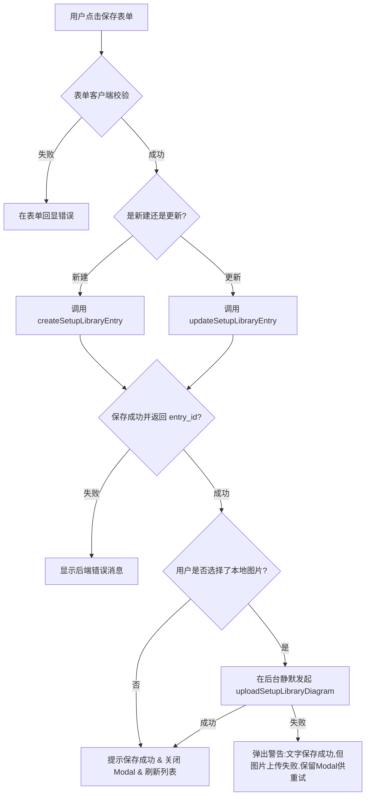

# CVD 实验 Setup 库前端实现设计

**日期**：2026-06-06
**状态**：待用户评审
**文档类型**：Design Spec
**范围**：Setup 库管理页面、API 客户端、实验编辑器 Setup 模块重写、详情页展示、继承机制与测试适配
**前置文档**：`SETUP_LIBRARY_HANDOFF.md`、`docs/superpowers/specs/2026-06-05-setup-methods-data-foundation-design.md`

---

## 1. 文档目标

本设计文档旨在明确 CVD 实验数据采集系统中 **Setup 库前端重构与开发** 的具体实施细节。

后端已完整实现了 Setup 库底层数据模型、软删除、可见性控制、示意图上传/下载、以及实验快照级联引用接口（全绿，238 个测试通过）。前端需要重构现有的 "模板与大表单确认" 模式，彻底转向 "可复用的 Setup 库" 流程：
1. **新建 Setup 库管理页面**：用户能集中录入标准 Setup、按可见性区分权限，并内联级联上传装置示意图。
2. **重写实验编辑器 Setup 模块**：删去原有冗余的 6 大必填文本框与语义 JSON 裸框，改为下拉选择库条目一键套用，并以只读方式预览快照，同时提供偏差说明输入（在与库条目不一致时）。
3. **完善实验详情页渲染**：在参数 Tab 下以卡片形式完整展示当前实验关联的 Setup 快照及示意图。
4. **增强实验新建继承机制**：空白创建实验时，自动在后台检测并继承上一条实验的 Setup 引用。

---

## 2. 路由与外壳导航集成

1. **新路由注册 (`frontend/src/app/router.tsx`)**
   - 引入新页面组件 `SetupLibraryPage`。
   - 新增路由项：`/setup-library`。

2. **主导航项加入 (`frontend/src/shared/ui/app-shell.tsx`)**
   - 在侧边导航栏的普通栏目组中（**所有人可见，非 admin-only 分组**，因为普通 Member 需要编辑/维护自己的私有或组内 Setup），增加 “Setup 库” 菜单，配以相应的图标（如 `DatabaseOutlined` 或 `SettingOutlined`）。

---

## 3. API 与类型定义层设计

### 3.1 类型声明微调 (`frontend/src/shared/types/api.ts`)

```typescript
// 1. 在 SetupMethodsRead 中新增关联字段
export type SetupMethodsRead = {
  id: string;
  experiment_run_id: string;
  source_template_key: string | null;
  source_template_version: number | null;
  source_setup_library_id: string | null; // <-- 新增：指向库的 UUID（不加外键约束）
  setup_key_snapshot: string | null;
  setup_name_snapshot: string;
  setup_version_snapshot: number;
  institution_snapshot: string | null;
  apparatus_description_snapshot: string;
  methods_text_snapshot: string;
  sample_placement_description_snapshot: string;
  reaction_flow_description_snapshot: string;
  reference_paper_url_snapshot: string | null;
  unpublished_reason_snapshot: string | null;
  diagram_file_asset_id: string | null;
  is_same_as_template: boolean;
  deviation_note: string | null;
  confirmed_by_id: string | null;
  confirmed_at: string | null;
  snapshot_hash: string;
  semantic_context: Record<string, unknown>;
  created_at: string;
  updated_at: string;
};

// 2. 新增可见性枚举类型
export type SetupVisibility = "private" | "group";

// 3. 新增 SetupLibraryEntry 相关类型定义
export type SetupLibraryRead = {
  id: string;
  owner_id: string;
  owner_name: string | null;
  visibility: SetupVisibility;
  is_active: boolean;
  name: string;
  institution: string | null;
  apparatus_description: string;
  methods_text: string;
  sample_placement_description: string;
  reaction_flow_description: string;
  reference_paper_url: string | null;
  unpublished_reason: string | null;
  has_diagram: boolean;
  diagram_original_name: string | null;
  diagram_download_url: string | null;
  content_hash: string;
  can_edit: boolean; // 后端根据权限（作者/Admin）动态返回，前端可用此字段控制编辑/删除按钮显隐
  semantic_context: Record<string, unknown>;
  created_at: string;
  updated_at: string;
};

export type SetupLibraryListResponse = {
  items: SetupLibraryRead[];
  total: number;
};

export type SetupLibraryCreateRequest = {
  name: string;
  institution?: string | null;
  visibility?: SetupVisibility;
  apparatus_description?: string;
  methods_text?: string;
  sample_placement_description?: string;
  reaction_flow_description?: string;
  reference_paper_url?: string | null;
  unpublished_reason?: string | null;
  semantic_context?: Record<string, unknown>;
};

export type SetupLibraryUpdateRequest = Partial<SetupLibraryCreateRequest>;
```

### 3.2 客户端 API 接口封装 (`frontend/src/features/setup-library/api.ts`)

为了保持模块化，新建接口请求文件封装后端接口：

- `listSetupLibrary(token: string)`: `GET /api/v1/setup-library`
- `getSetupLibraryEntry(token: string, id: string)`: `GET /api/v1/setup-library/{id}`
- `createSetupLibraryEntry(token: string, payload: SetupLibraryCreateRequest)`: `POST /api/v1/setup-library`
- `updateSetupLibraryEntry(token: string, id: string, payload: SetupLibraryUpdateRequest)`: `PATCH /api/v1/setup-library/{id}`
- `deactivateSetupLibraryEntry(token: string, id: string)`: `DELETE /api/v1/setup-library/{id}`（软删除）
- `uploadSetupLibraryDiagram(token: string, id: string, file: File)`: `POST /api/v1/setup-library/{id}/diagram` （Multipart Form-data）

并在现有的 `frontend/src/features/experiments/api.ts` 中新增引用关联接口：

- `createSetupMethodsFromLibrary(token: string, experimentId: string, setupLibraryId: string)`: `POST /api/v1/experiments/{id}/setup-methods/from-library`（返回类型为 `SetupMethodsMutationResponse`）

---

## 4. Setup 库管理页设计 (`setup-library-page.tsx`)

### 4.1 页面交互布局

1. **表格视图 (`Table`)**：
   - 列表包含列：名称（配有 `private/group` 可见性标签）、机构、作者、是否含有示意图、更新时间、操作。
   - 非 Viewer 用户顶部右侧显示 “新建 Setup” 按钮。
2. **操作逻辑**：
   - **查看**：任何可见条目均可点击 “查看详情”，在右侧抽屉 (`Drawer`) 中只读查看全部文本和图纸元数据。
   - **编辑**：若 `entry.can_edit === true`，显示编辑按钮，点击打开编辑弹窗。
   - **停用**：若 `entry.can_edit === true`，显示停用按钮，配有 `Popconfirm`：“确认要停用该 Setup 吗？引用此 Setup 的历史实验不受影响。”

### 4.2 级联保存流程

在表单 Modal 中，图片上传不再作为独立的操作流程，而是采取文字保存后的**后台自动级联上传**模式：



---

## 5. 实验编辑器重构设计

### 5.1 字段数据简化与逻辑删除 (`editor-types.ts` & `use-experiment-editor.ts`)

1. **`SetupMethodsValues` 类型微调**：
   - 添加 `sourceSetupLibraryId: string | null`。
   - 移除对 UI 暴露的 `semanticContextText` 属性。
2. **表单校验简化**：
   - 修改 `validateSectionValues` 方法，彻底删掉原本阻碍无感知保存的 Setup Section 语义 JSON 格式解析校验。
3. **完成度自适应**：
   - 移除了 apparatus/placement/flow 和 confirmed 的硬编码限制。
4. **核心应用逻辑迁移**：
   - 在 `use-experiment-editor.ts` 中废弃 `confirmSetupMethods` 与 `createSetupMethodsFromTemplate` 处理函数。
   - 新增并暴露 `applySetupLibrary(setupLibraryId: string)`。该函数内部调用 `createSetupMethodsFromLibrary`，成功后调用 `replaceSetupMethodsSnapshot` 更新编辑器状态及快照。

### 5.2 编辑器界面重写 (`setup-methods-section.tsx`)

1. **选择下拉区**（在草稿状态下显示）：
   - 展示来自 `listSetupLibrary` 的 Select 下拉框。
   - 下拉框右侧配备 “套用” 按钮以及 “预览” 按钮（点击后直接在当前页面以只读 Drawer 预览库条目内容，包含大图）。
   - 提供新标签页外链 `+ 新建/管理我的 Setup`。
2. **快照预览卡片**（一旦 `sourceSetupLibraryId` 非空时渲染）：
   - 以紧凑的侧边栏/区块形式，**只读回显**已冻结的快照字段：Setup 名称与机构、实验方法文本、其他辅助说明。
   - 从 `files` 数组（筛选 role 为 `setup_diagram` 的资产）匹配 `diagramFileAssetId`，直接内联展示大图或缩略图，并提供下载链接。
3. **偏差说明录入**：
   - 渲染多选框：“本次实验与该 Setup 一致”。
   - 若勾选，自动清空偏差信息并隐藏。
   - 若取消勾选，展开输入框：“本次偏差说明 (Deviation Note)”。该输入框修改支持原生失焦自动保存功能。

---

## 6. 实验详情页与继承逻辑设计

### 6.1 详情页 Setup 卡片展示 (`experiment-detail-page.tsx`)

1. **数据整合**：
   - 在详情页新增拉取快照详情 `getSetupMethods(accessToken, experimentId)`，发生 404 时作为“无 Setup”默默忽略。
2. **参数卡片追加**：
   - 在 "参数" 选项卡的顶部/适当位置追加 `<Card title="Setup / Methods">`。
   - 展示快照名称、机构、关联文献超链接/未发表声明、Methods 说明文本。
   - 匹配对应的示意图资源 `diagram_file_asset_id` 并作直接的图片预览。
   - 展示 `is_same_as_template` 状态。若有偏差，突出显示 `deviation_note`。

### 6.2 空白创建继承逻辑 (`experiment-new-page.tsx`)

1. **机制升级**：
   - 当前系统的空白 CVD 实验“立即创建”仅在 `sessionStorage` 写入上次实验的环境与预检查信息。
2. **级联克隆引用**：
   - 在 `createMutation` 过程中，在查询上次实验 `sourceExperiment` 时，增加拉取其 Setup 详情 `getSetupMethods`。
   - 若最近的实验引用了某个库条目（`source_setup_library_id` 非空），在成功创建新实验后，自动在后台静默发起一次 `createSetupMethodsFromLibrary(token, newExperiment.id, lastSetupLibraryId)` 的调用。
   - 这样，当新实验的编辑器页面加载时，其 Setup 快照、复制示意图等数据已完全在后台准备就绪，用户可以直接看到“已沿用上一条实验 Setup”。

---

## 7. 门禁与测试验证计划

### 7.1 前端门禁要求

在提交并集成代码前，必须确保前端通过以下门禁指令：
```bash
cd frontend
bun run lint
bun run typecheck
bun run test
bun run build
```

### 7.2 测试适配范围

由于重构涉及交互变化、API 移除（确认机制及种子模板移除），必须对下列测试文件进行同步更新：
1. **`setup-methods-section.test.tsx`**：
   - 彻底重写。移除对 6 个大表单输入、确认按钮和语义 JSON 解析报错的断言。
   - 编写新的断言：验证库条目 Select 的渲染、预览抽屉的触发、以及偏差多选框与文本框显示隐退的行为。
2. **`use-experiment-editor.test.tsx`**：
   - 将套用模板测试、确认 Setup 测试替换为 `applySetupLibrary` 测试，验证其正确分发状态。
3. **`experiment-editor-page.test.tsx`**：
   - 移除测试中对旧“确认 Setup”卡片交互的依赖，替换为选用 Setup 库并查看卡片只读预览。
4. **`experiment-new-page.test.tsx` / `experiment-detail-page.test.tsx`**：
   - 适配 Setup 快照渲染和新建时自动触发 `from-library` 接口 mock。
5. **新增 `setup-library-page.test.tsx`**：
   - 编写对管理页面的集成测试，覆盖：获取列表、新建/编辑 Modal 展开、以及文字保存 + 图片自动上传的级联交互。
